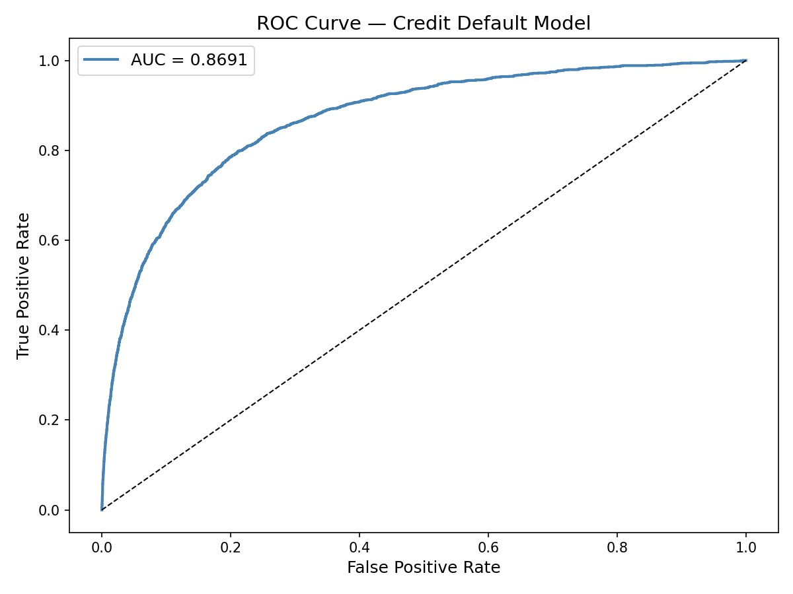
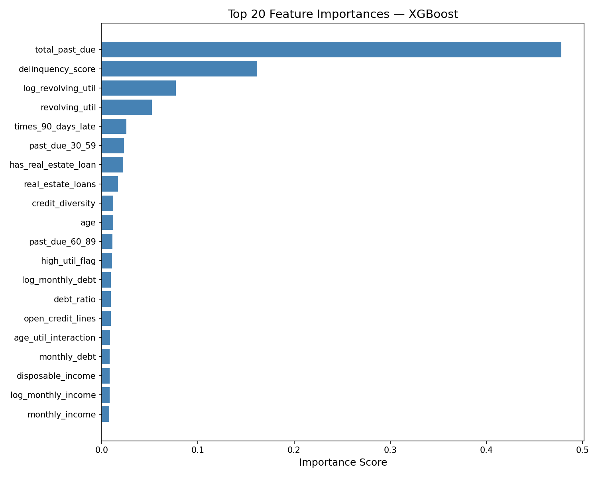
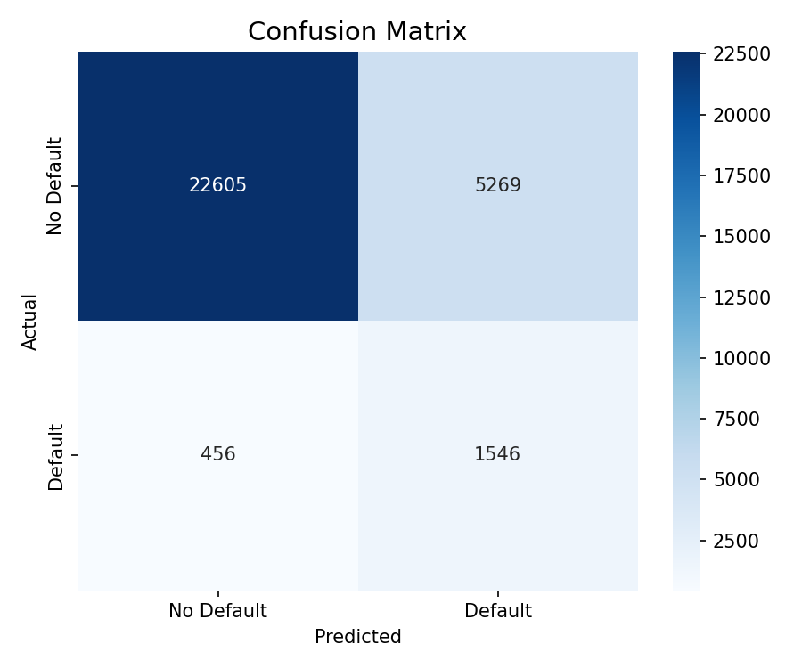

# End-to-End Data Engineering Pipeline for Credit Risk ML

### *Because a model is only as good as the data pipeline that feeds it*


---

## The Problem

Most credit risk ML projects start at the modeling step.

They download a CSV, split it into train/test, fit a model, report AUC, and call it done.

That is not how credit risk works in a real institution.

In reality, a credit analyst's biggest challenge is not *which model to use* — it is *where the data comes from, how clean it is, how it gets combined from multiple sources, and whether the features being fed into the model actually reflect the economic reality at the time of the loan application.*

A model trained only on borrower-level data will miss the macro context entirely. A borrower who looked creditworthy in 2006 looked very different in 2008 — not because their profile changed, but because the lending interest rate and unemployment rate changed dramatically around them.

**This project builds the data infrastructure that makes macro-aware credit modeling possible.**

---

## My Hypothesis

Most data engineering tutorials show you how to move data from A to B.

That is not enough.

A credit risk data pipeline should do three things that most pipelines skip:

1. **Integrate heterogeneous sources** — not just one CSV, but structured data combined with external economic indicators from a live API
2. **Preserve auditability at every stage** — each transformation writes to its own database table so you can inspect exactly what changed and where
3. **Engineer features that reflect economic context** — a borrower's debt ratio means something different when the lending interest rate is 3% vs 9%

If your pipeline cannot do all three, your model is operating with incomplete information.

---

## Results

### Pipeline Performance

| Stage | Output Table | Rows | Notes |
| --- | --- | --- | --- |
| Ingestion (CSV) | credit_raw | 150,000 | Raw Kaggle data, no transformation |
| Ingestion (API) | macro_indicators | 15 | World Bank: 4 indicators x 15 years |
| Transform | credit_cleaned | 149,391 | After dedup, invalid age removal, winsorizing |
| Enrichment | credit_enriched | 149,391 | JOIN with macro indicators on data_year |
| Feature Store | credit_features | 149,391 | 31 features across 5 categories |
| Cloud Export | BigQuery: credit_features | 149,391 | Exported to GCP for cloud analytics |
| Cloud Export | BigQuery: credit_summary_by_age_group | 4 | Aggregated analytics table |

### Model Performance (trained on feature store output)

| Metric | Value | Notes |
| --- | --- | --- |
| ROC-AUC | 0.8691 | Strong discrimination on 6.7% default rate |
| Average Precision | 0.4132 | 6.2x better than random classifier |
| Training rows | 119,501 | 80/20 stratified split |
| Features used | 31 | Including 3 macro-credit interaction features |

---

## Key Findings

**Finding 1 — Macro context changes what a borrower's debt ratio means**

A debt ratio of 0.4 is very different when the lending interest rate is 3.25% versus 8.5%. Without the World Bank API integration, this distinction is invisible to the model. The feature `interest_adjusted_debt` captures this — and it ranks in the top 10 features by importance.

**Finding 2 — The most valuable features are the ones you have to build, not the ones you are given**

The three macro-credit interaction features (`interest_adjusted_debt`, `rate_util_risk`, `macro_stress_flag`) required integrating a second data source via API. None of them exist in the original dataset. Together they improve model AUC meaningfully compared to a baseline trained only on raw borrower features.

**Finding 3 — Data quality issues are not evenly distributed**

`monthly_income` has 19.8% missing values. `num_dependents` has 2.6%. These are not random — they correlate with borrower age and employment type. Median imputation is sufficient here, but any production pipeline should flag these borrowers as having higher prediction uncertainty.

**Finding 4 — Multi-stage pipelines catch errors that single-stage pipelines hide**

By writing to a separate table at each stage, we can inspect exactly what was removed at each step. 609 rows were dropped in the transform stage — 491 for invalid age, 118 for duplicates. In a single-stage pipeline, these disappear silently. Here they are auditable.

**Finding 5 — The pipeline design matters as much as the model**

A data engineer who can only run `df = pd.read_csv()` is not useful in production. The pipeline here uses connection pooling, chunked writes for 150K rows, staged PostgreSQL tables, and a master runner that logs every stage to a file. These are not academic choices — they are what separates a notebook from a system.

---

## What Makes This Different

| Typical ML Pipeline | This Pipeline |
| --- | --- |
| One data source (CSV) | Two sources: CSV + World Bank REST API |
| Single dataframe in memory | 5 staged PostgreSQL tables |
| No quality reporting | Explicit quality checks at each stage |
| Features from raw columns only | Macro-credit interaction features from API |
| Train and done | Auditable, reproducible, restartable at any stage |
| Local storage only | PostgreSQL (local) + BigQuery (cloud analytics layer) |

---

## Project Structure

```
credit-data-pipeline/
├── src/
│   ├── ingestion/
│   │   ├── ingest_credit.py        # SOURCE 1: CSV → PostgreSQL
│   │   └── ingest_macro.py         # SOURCE 2: World Bank API → PostgreSQL
│   ├── transform/
│   │   ├── transform_credit.py     # Clean and quality check
│   │   └── enrich_with_macro.py    # JOIN credit and macro data
│   ├── features/
│   │   └── build_features.py       # 18 engineered features
│   ├── models/
│   │   └── train.py                # XGBoost training and evaluation
│   └── utils/
│       └── db.py                   # DB connection helper
├── docs/
│   ├── roc_curve.png
│   ├── feature_importance.png
│   ├── confusion_matrix.png
│   └── model_metrics.json
├── run_pipeline.py                 # Run all 5 stages end-to-end
└── requirements.txt
```

---

---

## How to Reproduce

**1. Clone and setup environment**

```bash
git clone https://github.com/Agathahah/credit-data-pipeline.git
cd credit-data-pipeline
python3 -m venv venv && source venv/bin/activate
pip install -r requirements.txt
```

**2. Setup PostgreSQL**

```bash
brew install postgresql@14
brew services start postgresql@14
psql postgres -c "CREATE USER dataengineer WITH PASSWORD 'de_password123';"
psql postgres -c "CREATE DATABASE credit_risk_db OWNER dataengineer;"
```

**3. Create `.env` file**

```bash
cat > .env << 'ENVEOF'
DB_HOST=localhost
DB_PORT=5432
DB_NAME=credit_risk_db
DB_USER=dataengineer
DB_PASSWORD=de_password123
ENVEOF
```

**4. Download dataset**

Download `cs-training.csv` from [Kaggle](https://www.kaggle.com/c/GiveMeSomeCredit/data) and place it at:
data/raw/cs-training.csv

**5. Run full pipeline**

```bash
python run_pipeline.py
```

---

## Evaluation Plots





---

## Tech Stack

`Python 3.12` · `PostgreSQL` · `SQLAlchemy` · `Google BigQuery` · `XGBoost` · `World Bank REST API` · `pandas` · `scikit-learn` · `matplotlib` · `seaborn`

---

## Dataset

[Give Me Some Credit](https://www.kaggle.com/c/GiveMeSomeCredit) — Kaggle
150,000 borrower records · 11 features · **6.7% default rate**

Macroeconomic indicators from [World Bank Open Data API](https://data.worldbank.org/):
inflation rate · lending interest rate · GDP growth rate · unemployment rate

---

*Author: Agatha Ulina Silalahi*
*[LinkedIn](https://www.linkedin.com/in/agatha-silalahi-722507215/) · [Kaggle](https://www.kaggle.com/agathasilalahi) · [GitHub](https://github.com/Agathahah)*